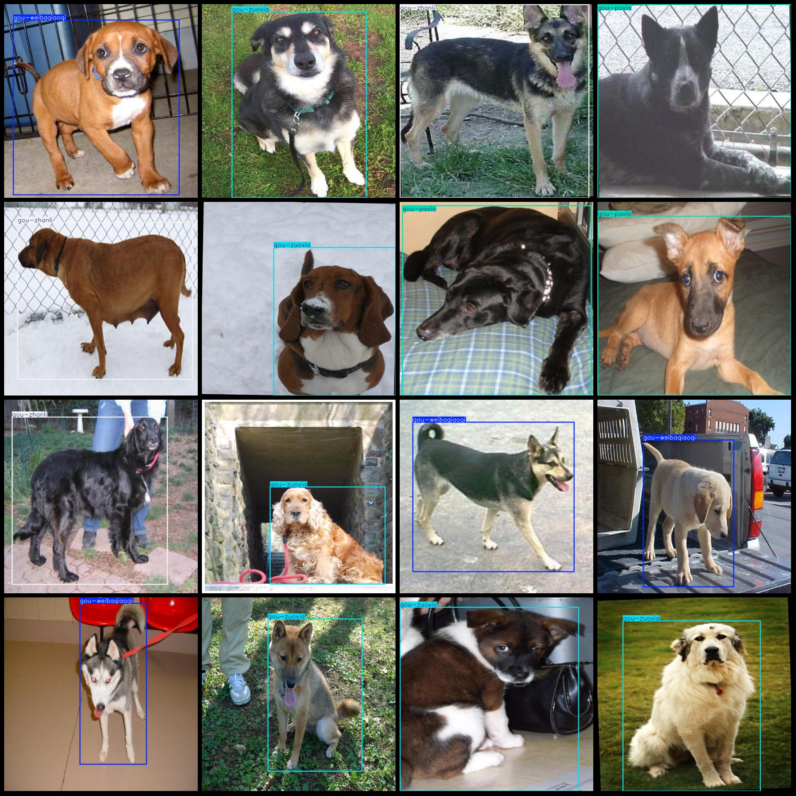
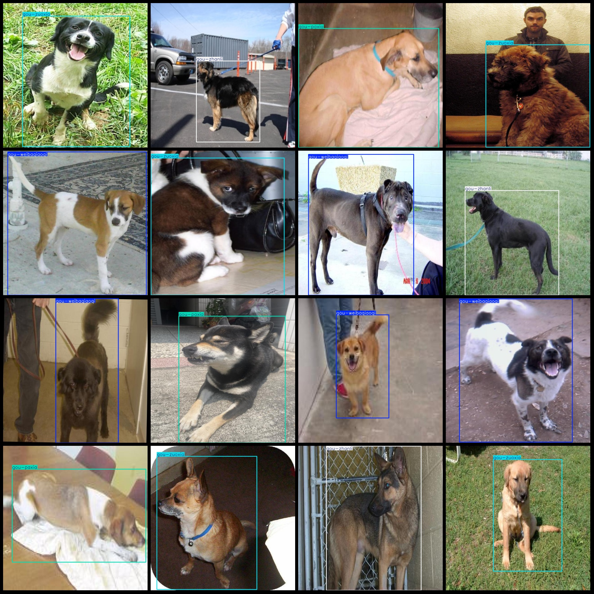

# Dog Posture Behavior Detection Dataset VOC+YOLO Format, 1282 Images in 4 Categories

Dataset format: Pascal VOC format + YOLO format (txt file without split path, only containing jpg images and corresponding VOC format xml files and yolo format txt files)
Number of images (total): 1282
Number of annotations (xml files): 1282
Number of annotations (txt files): 1282
Number of categories: 4
Categories names in yolov3 format (not consistent with this order according to yolo format, but based on the 'labels' folder 'classes.txt'): ["gou-paxia", "gou-weibaqiaoqi", "gou-zhanli", "gou-zuoxia"]
Chinese category names: ["dog-down", "dog-wag tail raised", "dog-standing", "dog-sitting"]
Number of boxes for each category:
gou-paxia = 333
gou-weibaqiaoqi = 321
gou-zhanli = 283
gou-zuoxia = 389
Total number of boxes: 1326
Number of images each category occupies:
gou-paxia = 315
The number of images owned by Gouwei Baqiaoqi is 314.
gou-zhanli images = 277  
gou-zuoxia images = 387  
image resolution: 640x640  
Using LabelImgAnnotation tool
Annotation rules: Draw a rectangle box around the class.
Important notes: The dataset does not have a separate training, validation, and test set. You need to divide it yourself.
Special statement: This dataset does not guarantee the accuracy of the trained model or weight files.
Image preview:
## Images

Here is a pay link on Stripe ( https://buy.stripe.com/3cs8yP7sY87d0vu9AB ). Please contact me lonlonago@foxmail.com after funding $89, and I will send you a complete data files , thank you!

